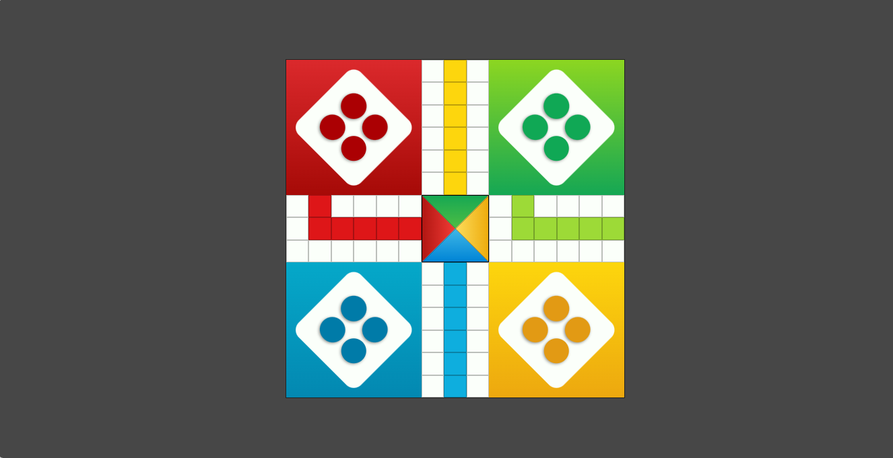

# Ludo Game Interface

A clean, modern, and responsive Ludo board interface built using semantic HTML5 and advanced CSS Grid techniques.
This project focuses on high-fidelity layout replication and responsive design.

## Live Demo
[View Ludo Game Interface Live](https://ezeigbo-david-onyedikachi.github.io/Ludo-Game-Interface-1/)

## Features
* **Precision Grid Layout:** Built with a 15x15 CSS Grid system for perfect alignment.
* **Fully Responsive:** Scales seamlessly from mobile devices to large desktop monitors using CSS `aspect-ratio`.
* **Modern UI:** Clean color palette (Red, Blue, Yellow, Green) with subtle shadows and polished borders.
* **Pure Frontend:** Created without external frameworks to showcase core web development skills.

## Why I Built This (My Journey)
This project was a major milestone during my early days in tech. It wasn't just about building a game; it was about mastering the building blocks of web development.

* **Gaining Grounded Knowledge:** Building the 15x15 grid helped me move past basic tutorials and actually understand how to structure complex layouts.
* **The Learning Curve:** Facing the challenge of a "scattered" layout after pushing to GitHub taught me the importance of responsive design and proper file paths.
* **Skill Foundation:** This project solidified my proficiency in HTML5 and CSS3, giving me the confidence to move on to more advanced frameworks like React and Flutter.
  
## Tech Stack
* **HTML5:** Semantic structure for the board and player zones.
* **CSS3:** CSS Grid, Flexbox, and Custom Variables (CSS Variables) for easy color management.

## Preview


## Project Structure
```text
├── index.html      # Main game structure
├── style.css       # Layout and styling (CSS Grid)
└── README.md       # Project documentation
